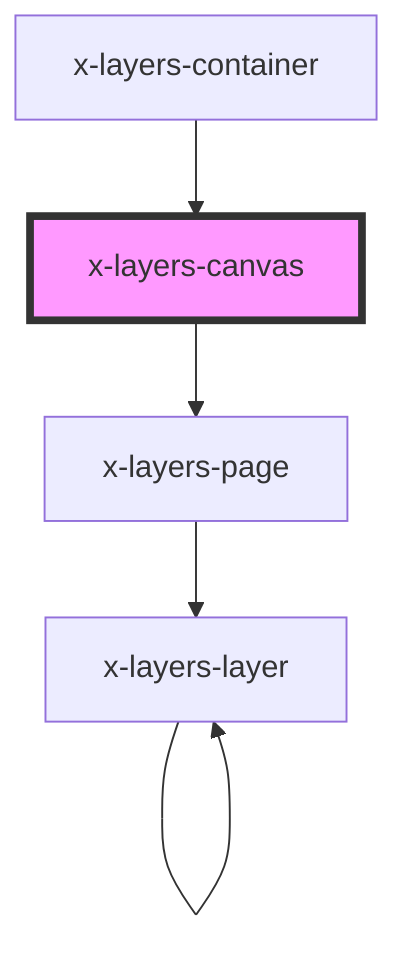

# x-layers-canvas

<!-- Auto Generated Below -->

## Properties

| Property    | Attribute   | Description | Type           | Default     |
| ----------- | ----------- | ----------- | -------------- | ----------- |
| `data`      | `data`      |             | `any`          | `undefined` |
| `mode`      | `mode`      |             | `"2d" \| "3d"` | `undefined` |
| `wireframe` | `wireframe` |             | `boolean`      | `undefined` |
| `zoom`      | `zoom`      |             | `number`       | `undefined` |

## Dependencies

### Used by

 - [x-layers-container](../x-layers-container)

### Depends on

- [x-layers-page](../x-layers-page)

### Graph

----------------------------------------------

*Built with [StencilJS](https://stenciljs.com/)*
