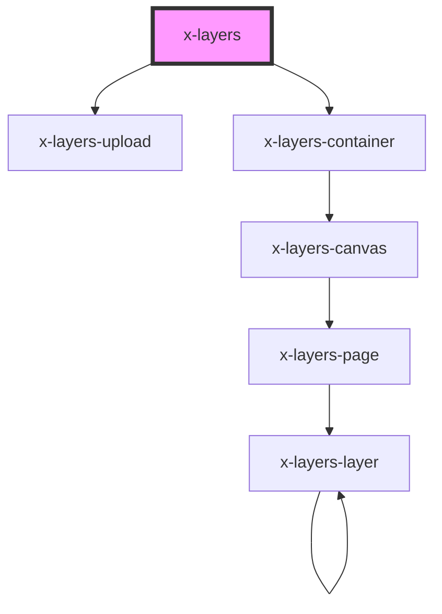

# x-layers

<!-- Auto Generated Below -->

## Properties

| Property    | Attribute   | Description | Type           | Default     |
| ----------- | ----------- | ----------- | -------------- | ----------- |
| `mode`      | `mode`      |             | `"2d" \| "3d"` | `"2d"`      |
| `src`       | `src`       |             | `string`       | `undefined` |
| `wireframe` | `wireframe` |             | `boolean`      | `false`     |
| `zoom`      | `zoom`      |             | `number`       | `1`         |

## Dependencies

### Depends on

- [x-layers-upload](../x-layers-upload)
- [x-layers-container](../x-layers-container)

### Graph

----------------------------------------------

*Built with [StencilJS](https://stenciljs.com/)*
